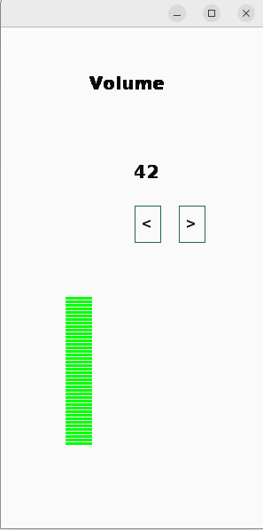

# Strigui example

A tiny example creating widgets with strigui (https://github.com/MikeHardIce/strigui).

```
lein deps
lein run
```



The volumne bar is defined in [widget_stacks.clj](src/strigui_sample/widget_stacks.clj)

## Create widgets via a edn file

gui-test.edn
```
{:window [300 400 "Strigui from Edn"]
 :strigui.label/Label [["title" "Volume" {:x 100 :y 50 :color [0xffaa11] :font-size 20 :font-style [:bold]}]
                       ["lbl-volume" 50 {:x 150 :y 150 :color [0xffaa11] :font-size 20 :font-style [:bold]}]]
 :strigui.button/Button [["left" "<" {:x 150 :y 200 :color [0x001133 :orange]
                                      :font-style [:bold] :min-width 30 :can-tab? true}]
                         ["right" ">" {:x 200 :y 200 :color [0x001133 :orange]
                                       :font-style [:bold] :min-width 30 :can-tab? true :selected true}]]
 :strigui-sample.widget-stacks/Stack [["volume" 50 {:x 70 :y 70 :max 100}]]}
```
in core.clj
```
ns strigui-sample.core
  (:require [strigui.core :as gui]
            [strigui-sample.widget-stacks])
  (:gen-class))
  
(defn -main
  "Little example"
  [& args]
  (gui/from-file "gui-test.edn")
  (let [volume (atom 50)]
    (gui/update! "left" :events {:mouse-clicked (fn [wdg]
                                                  (when (> @volume 0)
                                                    (swap! volume dec)
                                                    (gui/update! "volume" :value @volume)
                                                    (gui/update! "lbl-volume" :value @volume)))})
    (gui/update! "right" [:events :mouse-clicked] (fn [wdg]
                                                    (when (< @volume 100)
                                                      (swap! volume inc)
                                                      (gui/update! "volume" :value @volume)
                                                      (gui/update! "lbl-volume" :value @volume))))))
```

Note, if you use custom widget like 
```
:strigui-sample.widget-stacks/Stack
```
in the edn file, then make sure to include the namespace when loading the file.

## Create widgets inside your code
```
(ns strigui-sample.core
  (:require [strigui.core :as gui]
            [strigui-sample.widget-stacks :as st])
  (:gen-class))

(defn -main
  "Little example"
  [& args]
  (gui/window! 300 400 "Strigui")
  (gui/label! "title" "Volume" {:x 100 :y 50 :color [0xffaa11] :font-size 20 :font-style [:bold]})
  (gui/button! "left" "<" {:x 150 :y 200 :color [0x001133 :orange]
                          :font-style [:bold] :min-width 30 :can-tab? true})
  (gui/button! "right" ">" {:x 200 :y 200 :color [0x001133 :orange]
                                  :font-style [:bold] :min-width 30 :can-tab? true :selected true})
  (let [volume (atom 50)]
    (gui/create! (st/->Stack "volume" @volume {:x 70 :y 70 :max 100}))
    (gui/label! "lbl-volume" @volume {:x 150 :y 150 :color [0xffaa11] :font-size 20 :font-style [:bold] })
    (gui/update! "left" :events {:mouse-clicked (fn [wdg]
                                                  (when (> @volume 0)
                                                    (swap! volume dec)
                                                    (gui/update! "volume" :value @volume)
                                                    (gui/update! "lbl-volume" :value @volume)))})
    (gui/update! "right" [:events :mouse-clicked] (fn [wdg]
                                                    (when (< @volume 100)
                                                      (swap! volume inc)
                                                      (gui/update! "volume" :value @volume)
                                                      (gui/update! "lbl-volume" :value @volume))))))
```

The "stacks" widget representing the volume doesn't exist in strigui and is defined in [widget_stacks.clj](src/strigui_sample/widget_stacks.clj) as a new widget.

The new widget is registered and drawn via 
```
(gui/create! (st/->Stack "volume" @volume {:x 70 :y 70 :max 100}))
```